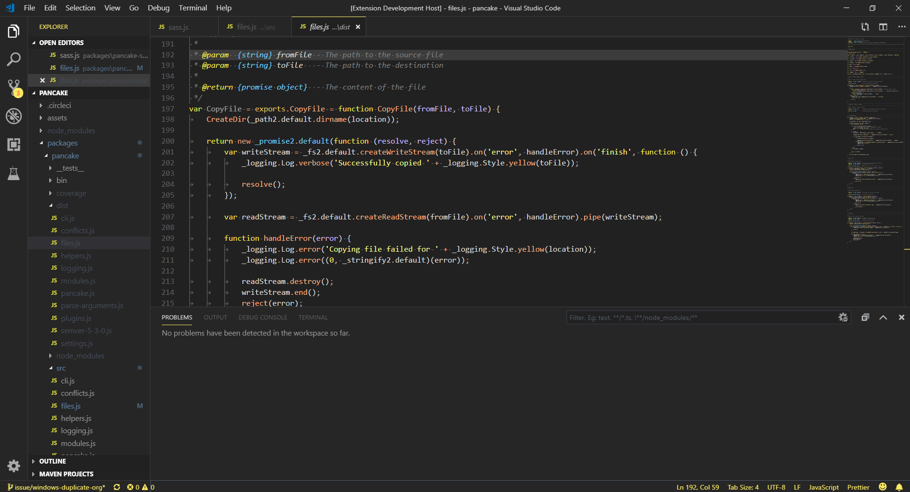

# vscode-bumblebee
> 🐝 Bumble Bee theme for vscode

A black and yellow color theme for `vscode` that meets [WCAG 2.1 AAA](https://www.w3.org/WAI/WCAG21/Understanding/contrast-minimum.html) colour contrast standards.

## Install

```bash
ext install adamzerella.bumblebee
```

Then navigate to `Preferences > Color Theme > Bumble Bee`.

## Preview



## Palette

<table>
  <tr><th>Code</th><th>Color</th></tr>
  <tr><td>common.accent</td><td style="background:#FFCC66;"></td></tr>
  <tr><td>common.bg</td><td style="background:#262626;"></td></tr>
  <tr><td>common.fg</td><td style="background:#DDDDDD;"></td></tr>
  <tr><td>common.ui</td><td style="background:#9C9C9C;"></td></tr>
  <tr><td>syntax.tag</td><td style="background:#E6C35C;"></td></tr>
  <tr><td>syntax.func</td><td style="background:#FFB080;"></td></tr>
  <tr><td>syntax.entity</td><td style="background:#73d0ff;"></td></tr>
  <tr><td>syntax.string</td><td style="background:#FCFA8A;"></td></tr>
  <tr><td>syntax.regexp</td><td style="background:#95e6cb;"></td></tr>
  <tr><td>syntax.markup</td><td style="background:#C67DED;"></td></tr>
  <tr><td>syntax.keyword</td><td style="background:#F2E74F;"></td></tr>
  <tr><td>syntax.special</td><td style="background:#ffe6b3;"></td></tr>
  <tr><td>syntax.comment</td><td style="background:#818181;"></td></tr>
  <tr><td>syntax.constant</td><td style="background:#d4bfffb3;"></td></tr>
  <tr><td>syntax.operator</td><td style="background:#f29e74;"></td></tr>
  <tr><td>syntax.error</td><td style="background:#ff3333;"></td></tr>
  <tr><td>ui.line</td><td style="background:#3c3c3c;"></td></tr>
  <tr><td>ui.panel.bg</td><td style="background:#212121;"></td></tr>
  <tr><td>ui.panel.shadow</td><td style="background:#141925;"></td></tr>
  <tr><td>ui.panel.border</td><td style="background:#101521;"></td></tr>
  <tr><td>ui.gutter.normal</td><td style="background:#616161;"></td></tr>
  <tr><td>ui.gutter.active</td><td style="background:#ffffff;"></td></tr>
  <tr><td>ui.selection.bg</td><td style="background:#2a3546;"></td></tr>
  <tr><td>ui.selection.inactive</td><td style="background:#262f3e;"></td></tr>
  <tr><td>ui.selection.border</td><td style="background:#313e52;"></td></tr>
  <tr><td>ui.guide.active</td><td style="background:#616161;"></td></tr>
  <tr><td>ui.guide.normal</td><td style="background:#616161;"></td></tr>
  <tr><td>vcs.added</td><td style="background:#A6CC70;"></td></tr>
  <tr><td>vcs.modified</td><td style="background:#77A8D9;"></td></tr>
  <tr><td>vcs.removed</td><td style="background:#F27983;"></td></tr>
</table>

## Local development

```bash
# NPM
npm i

# Yarn
yarn install
```

Press `F5` to launch a live preview and don't forget to switch the theme in the preview window!

## Contributors
<div style="display:inline;">
  <a href="https://github.com/adamzerella"></a>
</div>